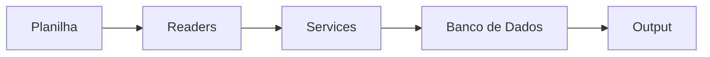

# Conversor de Planilhas Financeiras para o Domínio Sistemas

Projeto backend desenvolvido em **Python** com **MongoDB** para demonstrar boas práticas de programação orientada a objetos, modularização e integração com banco de dados.

---

## 🚀 Objetivo

O sistema tem como propósito **ler, processar e converter planilhas financeiras** que um escritório de contabilidade recebe de seus clientes em formatos que possam ser importados para o sistema contábil Domínio Sistemas.  

O foco é no **backend** — ou seja, toda a lógica está por trás, sem interface gráfica. No futuro, nada impede a criação de uma camada de frontend ou API.

---

## 🏗️ Arquitetura e Organização

A estrutura do projeto foi pensada para ser **modular, escalável e fácil de manter**:

- **data/**
  - `input/`: arquivos de entrada (planilhas originais)  
  - `output/`: arquivos processados pelo sistema  

- **src/**
  - **db/** → conexão com banco de dados e repositórios  
  - **models/** → modelos de dados (entidades)  
  - **readers/** → leitura de planilhas (tarifas, receitas, contas pagas etc.)  
  - **services/** → regras de negócio e processamento dos dados  

- **main.py** → ponto de integração principal com o usuário  
- **test.py** → ambiente de testes para validar novas funcionalidades sem impactar o main  

Fluxo do sistema:
Planilha → Readers → Services → Banco de Dados → Output

---

## 📈 Diagrama de Arquitetura



---

## 🔧 Tecnologias Utilizadas

- **Linguagem:** Python  
- **Banco de Dados:** MongoDB (poderia ser substituído por SQLite sem impacto estrutural)  
- **Bibliotecas:**  
  - `pandas` → manipulação de dados  
  - `openpyxl` → leitura de arquivos Excel  
  - `pymongo` → integração com MongoDB  

---

## 💡 Conceitos Aplicados

- Programação Orientada a Objetos (**POO**)  
  - Classes, herança e reutilização de código  
- Arquitetura em camadas (**Db → Services → Readers → Main**)  
- Testes de funcionalidades em ambiente separado (`test.py`)  
- Modularização e separação de responsabilidades  

---

## ▶️ Como Executar

1. Clone este repositório:
   ```bash
   git clone https://github.com/seu-usuario/conversor-planilha-txt-dominio.git
   cd conversor-planilha-txt-dominio
Crie e ative um ambiente virtual:

bash
Copiar código
python -m venv venv
source venv/bin/activate   # Linux/Mac
venv\Scripts\activate      # Windows
Instale as dependências:

bash
Copiar código
pip install -r requirements.txt
Configure a conexão com o banco no arquivo:

bash
Copiar código
src/db/conexao.py
Coloque as planilhas em data/input/ e rode o sistema:

bash
Copiar código
python main.py
Para testes isolados:

bash
Copiar código
python test.py
📊 Exemplo de Uso
Entrada: planilha com tarifas bancárias

Processamento: leitura → validação → armazenamento no MongoDB

Saída: arquivo convertido em data/output/ pronto para importação no sistema contábil

📌 Status do Projeto
 Estrutura inicial do backend

 Leitura de planilhas de tarifas bancárias

 Leitura e processamento de receitas

 Exportação completa para sistemas contábeis

 Documentação de API (se houver evolução futura)

📚 Próximos Passos
Expandir suporte a diferentes tipos de planilhas

Criar testes automatizados unitários/integrados

Implementar logs estruturados

Possível integração com frontend ou API REST

👨‍💻 Autor
Lucas Gomes de Oliveira
Backend Developer | Python | Java | Node.js | MongoDB

📍 Brasília – DF

📧 lucasgomescomp@hotmail.com

💼 [LinkedIn](https://www.linkedin.com/in/euolucasgomes/)

💻 [GitHub](https://github.com/euolucasgomes)