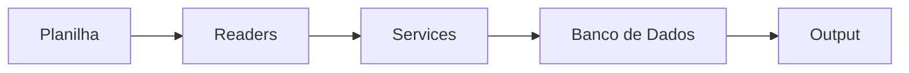

# Conversor de Planilhas Financeiras para o Domínio Sistemas

Projeto backend desenvolvido em **Python** com **MongoDB** para demonstrar boas práticas de programação orientada a objetos, modularização e integração com banco de dados.

---

## 🚀 Objetivo

O sistema tem como propósito **ler, processar e converter planilhas financeiras** que um escritório de contabilidade recebe de seus clientes em formatos que possam ser importados para o sistema contábil Domínio Sistemas.  

O foco é no **backend** — ou seja, toda a lógica está por trás, sem interface gráfica. No futuro, nada impede a criação de uma camada de frontend ou API.

---

## 🏗️ Arquitetura e Organização

A estrutura do projeto foi pensada para ser **modular, escalável e fácil de manter**:

- **data/**
  - `input/`: arquivos de entrada (planilhas originais)  
  - `output/`: arquivos processados pelo sistema  

- **src/**
  - **db/** → conexão com banco de dados e repositórios
  - **menus/** → organização do menu do sistema em que o usuário vai interagir  
  - **models/** → modelos de dados (entidades)  
  - **readers/** → leitura de planilhas (tarifas, receitas, contas pagas etc.)  
  - **services/** → regras de negócio e processamento dos dados
  - **writers/** → escrita dos arquivos em txt no formato em que o Domínio Sistemas importa 

- **main.py** → ponto de integração principal com o usuário  
- **test.py** → ambiente de testes para validar novas funcionalidades sem impactar o main  

Fluxo do sistema:
Planilha → Readers → Services → Banco de Dados → Output

---

## 📈 Diagrama de Arquitetura



---

## 🔧 Tecnologias Utilizadas

- **Linguagem:** Python  
- **Banco de Dados:** MongoDB (poderia ser substituído por SQLite sem impacto estrutural)  
- **Bibliotecas:**  
  - `pandas` → manipulação de dados  
  - `openpyxl` → leitura de arquivos Excel  
  - `pymongo` → integração com MongoDB
  - `datetime` → parametrização da data  

---

## 💡 Conceitos Aplicados

- Programação Orientada a Objetos (**POO**)  
  - Classes, herança e reutilização de código  
- Arquitetura em camadas (**Db → Services → Readers → Main**)  
- Testes de funcionalidades em ambiente separado (`test.py`)  
- Modularização e separação de responsabilidades  

---

## ▶️ Como Executar

1. Clone este repositório:
   ```bash
   git clone https://github.com/euolucasgomes/conversor-planilha-txt-dominio.git
   cd conversor-planilha-txt-dominio

📌 Status do Projeto
 Estrutura inicial do backend

 Leitura da aba de tarifas bancárias da planilha modelo
 Leitura da aba de receitas da planilha modelo
 Leitura da aba de apropriações da planilha modelo
 Processamento das tarifas bancárias
 Processamento das receitas
 Processamento das apropriações

 Exportação do txt (formato importável no Domínio Sistemas) de lançamentos contábeis de tarifas bancárias
 Exportação do txt (formato importável no Domínio Sistemas) de lançamentos contábeis de receitas
 Exportação do txt (formato importável no Domínio Sistemas) de lançamentos contábeis de apropriações

📚 Próximos Passos
Implementação de conversão da aba Contas Pagas

👨‍💻 Autor
Lucas Gomes de Oliveira
Backend Developer | Python | Java | Node.js | MongoDB

📍 Brasília – DF

📧 lucasgomescomp@hotmail.com

💼 [LinkedIn](https://www.linkedin.com/in/euolucasgomes/)

💻 [GitHub](https://github.com/euolucasgomes)